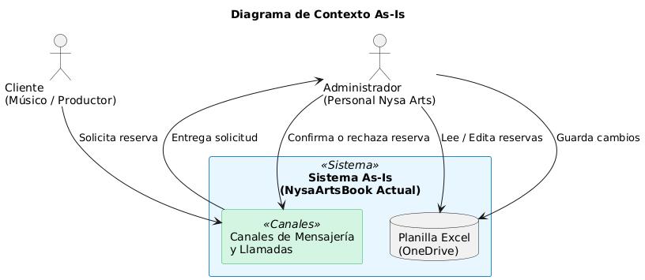
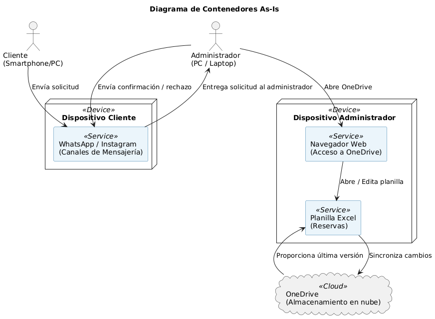
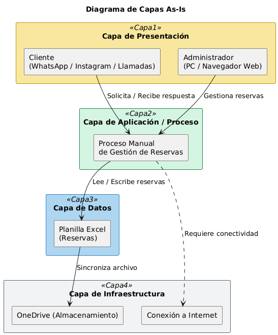

<!-- ============================================= -->
<!--                Portada del Informe             -->
<!-- ============================================= -->

  

---

# **Informe 1**

---

**Asignatura:** ARQUITECTURA DE SISTEMAS Sec. 2  
**Docente:** Eliana Jackeline Vivas Rafael  

---

## Integrantes
- Nevile Olguin  
- Mateo Moreira  
- Javiera Soto  
- Ian Schmidt  

---

**Fecha de entrega:** Jueves 5 de junio de 2025  

<!-- ============================================= -->

---

## 1. Descripción del proyecto y contexto

Nombre del sistema: NysaArtsBook

Cliente / Organización: Nysa Arts, empresa dedicada al arriendo de salas de ensayo y producción musical en Santiago de Chile.

Propósito: El propósito de NysaArtsBook es ofrecer una plataforma web que automatice por completo el proceso de reserva de salas, minimice los errores de registro y proporcione visibilidad en tiempo real sobre la ocupación de espacios, de modo que tanto los músicos como el equipo administrativo cuenten con información precisa y rápida para tomar decisiones.

Contexto de uso (narrativo):
En un mercado musical cada vez más competitivo y con demanda variable, Nysa Arts gestiona actualmente las solicitudes de reserva a través de canales informales como WhatsApp, Instagram o llamadas telefónicas. Cuando un músico o productor solicita una sala, el personal administrativo revisa manualmente un archivo de Excel alojado en OneDrive para verificar disponibilidad, anotar la nueva reserva y luego confirma al cliente por el mismo canal de mensajería. Este flujo genera demoras en la atención (que en promedio pueden llegar a 12–24 horas), errores manuales al duplicar o sobreescribir información y una completa falta de visibilidad instantánea de cuántas salas están realmente ocupadas.

La ausencia de un sistema integrado provoca que los músicos independientes, bandas emergentes, productoras y educadores musicales no tengan certidumbre inmediata sobre la disponibilidad, lo que se traduce en cancelaciones de último minuto y pérdida de oportunidades de negocio para Nysa Arts. Además, el equipo de administración carece de datos históricos estructurados para analizar tendencias de uso y planificar de forma proactiva.

Por tanto, NysaArtsBook se concibe como la solución que centraliza todas las peticiones en un único entorno web: los usuarios podrán visualizar en tiempo real las franjas disponibles, completar el formulario de reserva en línea y recibir una confirmación automática. Al mismo tiempo, el personal administrativo dispondrá de un panel de control que incorpora la base de datos centralizada, reportes de uso y alertas automáticas ante posibles colisiones de reservas. Con ello, se espera reducir drásticamente las demoras, eliminar los errores de registro y dotar a Nysa Arts de datos confiables para optimizar la operación y la toma de decisiones.

Ubicación de operación: Santiago de Chile (oficinas de Nysa Arts y salas de ensayo distribuidas en la ciudad).

Clientes principales:

    Músicos independientes que buscan espacios para ensayar.

    Bandas emergentes que requieren salas equipadas para pruebas de sonido.

    Productoras que necesitan espacios para grabaciones puntuales.

    Educadores musicales que reservan aulas para clases grupales.

## 2. Arquitectura As-Is

2.1 Diagrama de Contexto (C4 – Nivel 1)

**Figura 2.1. Diagrama de Contexto As-Is.**

El Diagrama de Contexto muestra el sistema tal como existe hoy (“As-Is”) y sus relaciones con los actores externos. En este caso, el sistema As-Is es el conjunto formado por la planilla de Excel en OneDrive más los canales de mensajería y llamadas que utilizan los clientes y administradores.

- **Sistema As-Is (caja central):** Conformado por los “Canales de Mensajería y Llamadas” (WhatsApp, Instagram y Llamadas) y la “Planilla Excel (OneDrive)”.
- **Actores externos:**
  - **Cliente:** Músico, banda o productor que solicita la reserva.
  - **Administrador:** Personal de Nysa Arts que revisa la planilla y confirma o rechaza la reserva.

**Explicación:**
1. El Cliente envía la petición de reserva mediante WhatsApp/Instagram o por llamada.
2. Dicha petición llega al Administrador (que trabaja sobre la planilla Excel en OneDrive).
3. El Administrador valida disponibilidad en la “Planilla Excel” y, según el resultado:
   - Si hay cupo, anota la reserva en la planilla y confirma al Cliente por el mismo canal.
   - Si no hay cupo, notifica al Cliente el rechazo.
4. No existe ningún otro sistema intermedio: todo se hace de forma manual entre el Administrador y la planilla Excel.

---

2.2 Diagrama de Componentes (C4 – Nivel 2 / Contenedores)
   En este diagrama se identifican los distintos “contenedores” que componen el sistema As-Is, señalando cómo se conectan entre sí.

**Figura 2.2. Diagrama de Contenedores As-Is.**

En este diagrama se identifican los distintos “contenedores” que componen el sistema As-Is, señalando cómo se conectan entre sí.

- **ClienteDevice:** Dispositivo del Cliente (smartphone o PC).  
  - Componente “WhatsApp / Instagram (Canales de Mensajería)”.  
- **AdminDevice:** Dispositivo del Administrador (PC o laptop).  
  - Componente “Navegador Web (accede a OneDrive → Excel)”.  
  - Componente “Planilla Excel (Reservas)”.  
- **OneDrive:** Servicio de almacenamiento en la nube donde reside la planilla Excel.

**Explicación:**
1. El Cliente usa su dispositivo para enviar la petición a través de WhatsApp / Instagram.
2. El Administrador, desde su PC/laptop, abre el Navegador Web y accede a OneDrive para editar la Planilla Excel.
3. Cada vez que el Administrador guarda la planilla, OneDrive sincroniza el archivo automáticamente.
4. No existe una base de datos relacional ni un backend; todo el procesamiento es manual sobre la hoja de cálculo.

---

2.3 Diagrama de Capas de la Arquitectura Empresarial (As-Is)

Este diagrama muestra cómo, en el esquema actual, las responsabilidades están organizadas por capas, aunque todas ellas dependen, en última instancia, de la planilla Excel y de la comunicación manual.

    **Figura 2.3. Diagrama de Capas de la Arquitectura Empresarial As-Is.**

- **Capa de Presentación**  
  - **Cliente (UI):** WhatsApp, Instagram o llamada telefónica.  
  - **Administrador (UI):** Navegador Web que abre OneDrive → Excel.  

- **Capa de Aplicación / Proceso**  
  - **Proceso Manual de Gestión de Reservas:** Lógica totalmente manual donde el administrador revisa disponibilidad, ingresa la nueva reserva y notifica al cliente.  

- **Capa de Datos**  
  - **Planilla Excel (Reservas):** Archivo compartido que funciona como “base de datos” improvisada.  

- **Capa de Infraestructura**  
  - **OneDrive:** Almacenamiento en la nube para la planilla.  
  - **Conexión a Internet:** Toda la operación depende de tener conectividad para abrir/sincronizar la hoja.  

**Explicación:**

1. En la **Capa de Presentación**, tanto el cliente como el administrador interactúan con el sistema:  
   - El cliente usa WhatsApp/Instagram o una llamada para solicitar la reserva.  
   - El administrador usa el navegador web para acceder a OneDrive y editar la planilla.  

2. En la **Capa de Aplicación / Proceso**, no existe un servicio automatizado:  
   - El “Proceso Manual de Gestión de Reservas” es la “lógica” real, pero se ejecuta de forma humana, no en un servidor o backend.  

3. En la **Capa de Datos**, la única fuente de verdad es la **Planilla Excel**, que se comporta como base de datos.  

4. En la **Capa de Infraestructura**, OneDrive y la conexión a Internet son imprescindibles para que cualquier cambio en la hoja se comparta entre usuarios.  

1.4  Servicios utilizados (As-Is)

- **OneDrive**  
  Repositorio en la nube donde se aloja la planilla Excel que funciona como base de datos improvisada.  
- **Canales de mensajería (WhatsApp, Instagram)**  
  Vía principal para recibir solicitudes de reserva y enviar confirmaciones o rechazos al cliente.  
- **Llamadas telefónicas**  
  Canal alternativo de comunicación entre cliente y administración cuando no se utiliza mensajería digital.  

Restricciones (As-Is)

1. **Sin transacciones atómicas en la planilla Excel**  
   - Si dos administradores abren y editan simultáneamente el archivo, pueden sobrescribirse datos sin control de versiones.  
2. **Falta de histórico estructurado**  
   - La planilla no guarda un registro completo de cambios; no existe auditoría ni versiones previas de cada reserva.  
3. **Latencia en la respuesta al cliente**  
   - El flujo manual (leer mensaje, abrir Excel, editar, notificar) introduce tiempos de espera de 12–24 horas en promedio.  
4. **Sin monitoreo ni alertas automáticas**  
   - No hay mecanismos que notifiquen fallos de sincronización en OneDrive ni avisen sobre colisiones de edición en la hoja.  
5. **Dependencia total de conectividad a Internet y de OneDrive**  
   - Si falla la conexión a Internet o OneDrive sufre interrupciones, el sistema queda inaccesible y no se pueden gestionar ni consultar reservas.

## 3. Análisis de Arquitectura Empresarial

### Stakeholder y Usuario Principal

- **Stakeholder principal:** Nysa Arts — empresa que arrienda salas de ensayo musical y producción en Santiago de Chile.
- **Usuario principal:** Clientes (músicos, productores, educadores) que arriendan espacios para fines creativos.

---

### Objetivos Estratégicos y Contribución del Sistema

| Objetivo Estratégico                                 | Contribución del Sistema                                                                 |
|------------------------------------------------------|-------------------------------------------------------------------------------------------|
| Mejorar la eficiencia operativa                      | Disminuye procesos manuales e introduce automatización en reservas y gestión de salas.    |
| Reducir errores y tiempos de espera                  | Sistema disponible 24/7 con confirmaciones automáticas y validación en tiempo real.       |
| Mejorar la experiencia y fidelización de los clientes| Plataforma intuitiva y autogestionable con interfaz clara y transparente.                 |
| Aumentar el porcentaje de ocupación                  | Información en tiempo real para ofrecer automáticamente salas disponibles.                |

---

### Proceso Clave del Negocio

- Desarrollo de un sistema que permita a los clientes arrendar salas de forma cómoda, autónoma y eficiente.
- Gestión del flujo completo: desde la disponibilidad hasta la confirmación.

---

### Componentes Clave

#### Procesos

- Reserva de salas y validación de disponibilidad.
- Gestión de usuarios y equipamiento.

#### Aplicaciones

- Aplicación desarrollada en Node.js y React, con manejo de datos en tiempo real.
- Comunicación a través de APIs RESTful.

#### Datos

- Base de datos estructurada con usuarios, salas, horarios y reservas.
- Datos actualizados en tiempo real, soportados por servicios cloud.

#### Infraestructura

- Hosting en la nube administrado por terceros (Heroku, Firebase, etc.).
- Escalable y con bajo costo de operación.

---

### Modelo de Arquitectura en 7 Capas

| Capa                    | Descripción                                                                                  |
|-------------------------|----------------------------------------------------------------------------------------------|
| **1. Presentación**     | Aplicación web responsive en React, accesible desde dispositivos móviles y escritorio.       |
| **2. Aplicación**       | Backend en Node.js con lógica de negocio: validación, reservas, notificaciones.              |
| **3. Servicios**        | API RESTful para la interacción entre clientes, frontend y base de datos.                    |
| **4. Datos**            | Base de datos relacional con persistencia de usuarios, reservas e inventario.                |
| **5. Integración**      | Espacio para futuras conexiones con pasarelas de pago, Google Calendar o redes sociales.     |
| **6. Infraestructura**  | Servicios cloud con despliegue continuo, backups automáticos y escalabilidad.                |
| **7. Seguridad**        | Autenticación por JWT, HTTPS con TLS 1.2+, control de roles, validaciones y logs de acceso.  |

---

### Diagrama Motivacional (resumen conceptual)

- **Actores:** Clientes, equipo administrativo de Nysa Arts.
- **Objetivos:** Agilizar la reserva, reducir errores, mejorar la experiencia de uso.
- **Drivers:** Alta demanda, procesos manuales ineficientes, necesidad de escalabilidad.

## 4 Requerimientos del Sistema

## Funcionales

| Categoría                  | Requerimiento Funcional         | Explicación                                                                 |
|---------------------------|----------------------------------|------------------------------------------------------------------------------|
| Reservas de Salas         | Verificación de disponibilidad   | El sistema consulta disponibilidad de sala y equipos según bloques de tiempo. |
| Reservas de Salas         | Disponibilidad continua          | El sistema está disponible al público todo el tiempo para realizar reservas. |
| Reservas de Salas         | Mail de confirmación             | Se envía un mail para confirmar la identidad y la reserva.                  |
| Reservas de Salas         | Registro de reserva              | Se registran en la base de datos los detalles de sala, horario y equipamiento. |
| Reservas de Salas         | Notificación al centro           | Se envía automáticamente al centro la información de la reserva realizada.  |
| Inventario                | Validación de disponibilidad     | Se valida que el equipo solicitado esté disponible en la sala antes de confirmar. |
| Inventario                | Actualización de inventario      | El sistema actualiza el estado de los equipos según reservas confirmadas/liberadas. |
| Inventario                | Gestión de inventario            | El sistema permite registrar, actualizar y eliminar equipos por sala.        |
| Recopilación y análisis   | Registro histórico de reservas   | Se almacenan todas las reservas para análisis posterior.                    |
| Recopilación y análisis   | Análisis de patrones             | Se detectan tendencias de uso de salas y equipos a partir de los datos.     |
| Recopilación y análisis   | Generación de reportes           | El sistema genera reportes automáticos sobre uso, frecuencia y cancelaciones. |

## No funcionales

| Categoría       | Requerimiento No Funcional | Explicación                                                                 |
|-----------------|----------------------------|------------------------------------------------------------------------------|
| Disponibilidad  | 24/7                        | El sistema debe estar disponible para los usuarios en todo momento.         |
| Rendimiento     | Respuesta rápida            | El sistema debe responder en menos de 1 segundo bajo carga normal.          |
| Seguridad       | Cifrado y control de acceso | Debe usar TLS 1.2 o superior, con roles definidos y validación de acceso.   |
| Escalabilidad   | Autoescalado                | El sistema debe escalar automáticamente al superar el 70 % de uso de CPU.   |
| Usabilidad      | Interfaz amigable           | Debe contar con una interfaz intuitiva y optimizada para dispositivos móviles. |
| Mantenibilidad  | Código modular               | El sistema debe estar desarrollado con arquitectura modular y pruebas automatizadas. |

---

## 5. Perfil Operacional

### 5.1 Escenarios de Uso (Proceso Clave: Reserva de Salas)

| Escenario clave               | Descripción                                                                 |
|------------------------------|-----------------------------------------------------------------------------|
| Consulta de disponibilidad   | Visualización en tiempo real de salas e instrumentos según bloque horario. |
| Reserva y modificación       | Solicitud, edición o cancelación de reservas por parte del cliente.        |
| Gestión de inventario        | Asignación y control de equipos disponibles por sala.                      |
| Notificaciones automáticas   | Confirmaciones y recordatorios automáticos de reservas.                   |
| Análisis y predicción de uso | Registro histórico y análisis de demanda futura.                           |

---

### 5.2 Usuarios

| Usuario                  | Rol                                                                 |
|--------------------------|----------------------------------------------------------------------|
| Clientes                 | Músicos o bandas que reservan salas para ensayo o producción.       |
| Personal administrativo  | Gestionan reservas, validan inventario y atención al cliente.       |
| Dueños / Gestión         | Analizan datos para toma de decisiones estratégicas.                |

---

### 5.3 Restricciones

- **Técnicas**: Tecnologías open-source (Node.js, React, PostgreSQL), bajo costo.
- **Económicas**: Sin subscripciones mensuales ni servidores caros.
- **Temporales**: Tiempo limitado (4–6 meses de desarrollo).
- **Operativas**: Alta demanda en horario pico, necesidad de disponibilidad continua.

---

### 5.4 Atributos de Calidad Prioritarios

| Atributo         | Prioridad | Justificación                                                                                   |
|------------------|-----------|--------------------------------------------------------------------------------------------------|
| Rendimiento      | Alta      | Respuesta rápida evita que los usuarios abandonen el proceso de reserva.                        |
| Disponibilidad   | Alta      | Debe estar operativo 24/7, especialmente durante horas pico.                                     |
| Seguridad        | Media-Alta| Se manejan datos personales; se requiere control de acceso y protección de información.         |
| Escalabilidad    | Media     | Aumento progresivo de usuarios y reservas requiere infraestructura adaptable.                   |
| Mantenibilidad   | Media     | El sistema debe poder ser actualizado fácilmente por equipos técnicos reducidos.                |
| Usabilidad       | Media     | Usuarios no técnicos requieren una interfaz clara y sencilla para reservar.                    |

---

### 5.5 Escenarios de Calidad (Formato ATAM)

#### Escenario 1: Rendimiento

> **Cuando** un cliente accede al sistema para consultar disponibilidad de salas e instrumentos,  
> **el sistema debe** mostrar los resultados en menos de 2 segundos,  
> **bajo** una carga de hasta 30 usuarios concurrentes y con 10.000 registros en la base de datos.

**Justificación**: Mejora la tasa de reservas exitosas y evita que los clientes recurran a canales manuales como WhatsApp.

---

## 6 Aplicación de ATAM (básico)

## Atributos de calidad

1. **Rendimiento**: < 500 ms para 100 usuarios simul.  
2. **Seguridad**: Protección contra inyección SQL/XSS.  
3. **Disponibilidad**: Recuperación tras fallo de contenedor.  
4. **Escalabilidad**: Provisionar nuevas réplicas en < 2 min.  
5. **Mantenibilidad**: MTTC < 1 hora para parches críticos.

## Escenarios de calidad

- 100 usuarios realizan consultas simultáneas.  
- Intento de inyección SQL bloqueado por WAF.  
- Falla de un contenedor y recuperación automática.

#### Escenario 2: Disponibilidad

> **Cuando** se produce una falla parcial del sistema (como la caída de un contenedor),  
> **el sistema debe** recuperarse automáticamente en menos de 2 minutos,  
> **bajo** una arquitectura con monitoreo activo y balanceo de carga, asegurando ≥ 99% de disponibilidad.

**Justificación**: Asegura continuidad durante horarios críticos, evitando pérdida de reservas y frustración de usuarios.

---

## 7 Análisis de Brechas

| Aspecto               | As-Is                                 | To-Be                                           | Brecha |
|-----------------------|---------------------------------------|-------------------------------------------------|-------:|
| Automatización        | Manual (Excel)                        | Web app con base de datos relacional            | Alta   |
| Viabilidad            | Ninguna en tiempo real                | Dashboard en React                              | Alta   |
| Escalabilidad         | Limitada al Excel                     | Microservicios en Docker                        | Media  |
| Predicción de demanda | No existe                             | Módulo SARIMA                                   | Alta   |
| Seguridad             | Nula                                  | JWT + TLS                                       | Alta   |
| Disponibilidad        | Archivo local, disponibilidad solo local | Alta disponibilidad con balanceador de carga  | Alta   |
| Usabilidad            | Interfaz de Excel, poco intuitivo     | UI responsive y accesible                       | Media  |
| Monitoreo y logging   | No existe                             | Logs centralizados y alertas con ELK Stack      | Alta   |
| Respaldo y recuperación | Copias manuales de Excel             | Backups automáticos y recuperación programada   | Alta   |
| Mantenibilidad        | Código y lógica en Excel              | Código modular en Node.js/React + tests         | Media  |
| Cumplimiento normativo| No existe                             | Gestión de datos con GDPR/Privacy Shield         | Media  |

---

# Bibliografía

- Informe de Avance Capstone (Grupo 6), Capstone Project, Nysa Arts, 2024.  
- Nevile8. (s.f.). *final*. GitHub. Recuperado el 5 de junio de 2025, de https://github.com/Nevile8/final  
- Nysa Arts. (s.f.). *Nysa Arts Demo*. Recuperado el 5 de junio de 2025, de https://nyssaa.netlify.app/

