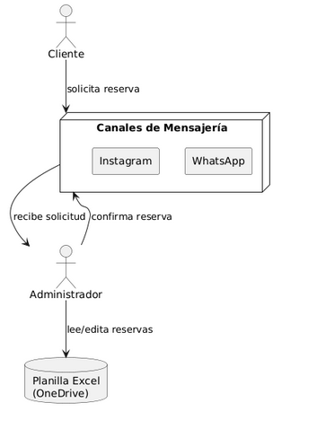
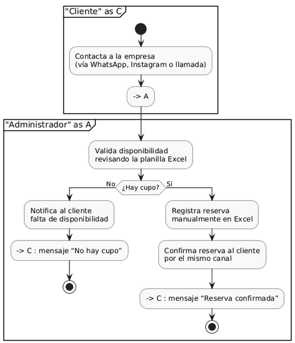

<!-- ============================================= -->
<!--                Portada del Informe             -->
<!-- ============================================= -->

  

---

# **Informe 1**

---

**Asignatura:** ARQUITECTURA DE SISTEMAS Sec. 2  
**Docente:** Eliana Jackeline Vivas Rafael  

---

## Integrantes
- Nevile Olguin  
- Mateo Moreira  
- Javiera Soto  
- Ian Schmidt  

---

**Fecha de entrega:** Jueves 5 de junio de 2025  

<!-- ============================================= -->

---

# Descripción del proyecto y contexto

En un mercado musical cada vez más competitivo y con demanda variable, **Nysa Arts** busca modernizar su sistema de gestión de reservas. Actualmente los músicos y productores solicitan salas de ensayo y producción mediante WhatsApp, Instagram o llamadas telefónicas, y los administradores registran las solicitudes en una planilla de Excel en OneDrive, lo cual genera:

- Demoras en la respuesta.  
- Errores manuales.  
- Falta de visibilidad en tiempo real de la ocupación de espacios.  

**Ubicación**: Santiago de Chile  
**Clientes principales**: Músicos independientes, bandas emergentes, productoras y educadores musicales.

# Arquitectura As-Is

## Componentes principales

- **Clientes**: Usuarios que contactan a través de WhatsApp o Instagram.  
- **Administración**: Personal de Nysa Arts que actualiza la planilla Excel.  
- **Base de datos**: Hoja de cálculo en Excel.  
- **Comunicación**: WhatsApp, Instagram y llamadas telefónicas.  

{#fig:componentes}

*Figura 1. Diagrama de Componentes As-Is*

## Flujo de datos

1. El cliente se contacta por WhatsApp, Instagram o llamada.  
2. El administrador revisa manualmente la planilla de Excel.  
3. Si hay disponibilidad, registra la reserva en la planilla.  
4. Confirma la reserva al cliente por el mismo canal.

{#fig:flujo}

*Figura 2. Diagrama de Actividad (flujo de datos)*

## Restricciones principales

- **Sin transacciones atómicas**: Riesgo de sobrescritura al editar simultáneamente.  
- **No hay histórico estructurado**: Dificultad para análisis de tendencias.  
- **Latencia**: Demoras de minutos u horas en reflejar cambios.  
- **Sin monitoreo o control de concurrencia**: No hay bloqueo ni alertas automáticas.

## 3. Análisis de Arquitectura Empresarial

### Stakeholder y Usuario Principal

- **Stakeholder principal:** Nysa Arts — empresa que arrienda salas de ensayo musical y producción en Santiago de Chile.
- **Usuario principal:** Clientes (músicos, productores, educadores) que arriendan espacios para fines creativos.

---

### Objetivos Estratégicos y Contribución del Sistema

| Objetivo Estratégico                                 | Contribución del Sistema                                                                 |
|------------------------------------------------------|-------------------------------------------------------------------------------------------|
| Mejorar la eficiencia operativa                      | Disminuye procesos manuales e introduce automatización en reservas y gestión de salas.    |
| Reducir errores y tiempos de espera                  | Sistema disponible 24/7 con confirmaciones automáticas y validación en tiempo real.       |
| Mejorar la experiencia y fidelización de los clientes| Plataforma intuitiva y autogestionable con interfaz clara y transparente.                 |
| Aumentar el porcentaje de ocupación                  | Información en tiempo real para ofrecer automáticamente salas disponibles.                |

---

### Proceso Clave del Negocio

- Desarrollo de un sistema que permita a los clientes arrendar salas de forma cómoda, autónoma y eficiente.
- Gestión del flujo completo: desde la disponibilidad hasta la confirmación.

---

### Componentes Clave

#### Procesos

- Reserva de salas y validación de disponibilidad.
- Gestión de usuarios y equipamiento.

#### Aplicaciones

- Aplicación desarrollada en Node.js y React, con manejo de datos en tiempo real.
- Comunicación a través de APIs RESTful.

#### Datos

- Base de datos estructurada con usuarios, salas, horarios y reservas.
- Datos actualizados en tiempo real, soportados por servicios cloud.

#### Infraestructura

- Hosting en la nube administrado por terceros (Heroku, Firebase, etc.).
- Escalable y con bajo costo de operación.

---

### Modelo de Arquitectura en 7 Capas

| Capa                    | Descripción                                                                                  |
|-------------------------|----------------------------------------------------------------------------------------------|
| **1. Presentación**     | Aplicación web responsive en React, accesible desde dispositivos móviles y escritorio.       |
| **2. Aplicación**       | Backend en Node.js con lógica de negocio: validación, reservas, notificaciones.              |
| **3. Servicios**        | API RESTful para la interacción entre clientes, frontend y base de datos.                    |
| **4. Datos**            | Base de datos relacional con persistencia de usuarios, reservas e inventario.                |
| **5. Integración**      | Espacio para futuras conexiones con pasarelas de pago, Google Calendar o redes sociales.     |
| **6. Infraestructura**  | Servicios cloud con despliegue continuo, backups automáticos y escalabilidad.                |
| **7. Seguridad**        | Autenticación por JWT, HTTPS con TLS 1.2+, control de roles, validaciones y logs de acceso.  |

---

### Diagrama Motivacional (resumen conceptual)

- **Actores:** Clientes, equipo administrativo de Nysa Arts.
- **Objetivos:** Agilizar la reserva, reducir errores, mejorar la experiencia de uso.
- **Drivers:** Alta demanda, procesos manuales ineficientes, necesidad de escalabilidad.

# Requerimientos del Sistema

## Funcionales

| Categoría                  | Requerimiento Funcional         | Explicación                                                                 |
|---------------------------|----------------------------------|------------------------------------------------------------------------------|
| Reservas de Salas         | Verificación de disponibilidad   | El sistema consulta disponibilidad de sala y equipos según bloques de tiempo. |
| Reservas de Salas         | Disponibilidad continua          | El sistema está disponible al público todo el tiempo para realizar reservas. |
| Reservas de Salas         | Mail de confirmación             | Se envía un mail para confirmar la identidad y la reserva.                  |
| Reservas de Salas         | Registro de reserva              | Se registran en la base de datos los detalles de sala, horario y equipamiento. |
| Reservas de Salas         | Notificación al centro           | Se envía automáticamente al centro la información de la reserva realizada.  |
| Inventario                | Validación de disponibilidad     | Se valida que el equipo solicitado esté disponible en la sala antes de confirmar. |
| Inventario                | Actualización de inventario      | El sistema actualiza el estado de los equipos según reservas confirmadas/liberadas. |
| Inventario                | Gestión de inventario            | El sistema permite registrar, actualizar y eliminar equipos por sala.        |
| Recopilación y análisis   | Registro histórico de reservas   | Se almacenan todas las reservas para análisis posterior.                    |
| Recopilación y análisis   | Análisis de patrones             | Se detectan tendencias de uso de salas y equipos a partir de los datos.     |
| Recopilación y análisis   | Generación de reportes           | El sistema genera reportes automáticos sobre uso, frecuencia y cancelaciones. |

## No funcionales

| Categoría       | Requerimiento No Funcional | Explicación                                                                 |
|-----------------|----------------------------|------------------------------------------------------------------------------|
| Disponibilidad  | 24/7                        | El sistema debe estar disponible para los usuarios en todo momento.         |
| Rendimiento     | Respuesta rápida            | El sistema debe responder en menos de 1 segundo bajo carga normal.          |
| Seguridad       | Cifrado y control de acceso | Debe usar TLS 1.2 o superior, con roles definidos y validación de acceso.   |
| Escalabilidad   | Autoescalado                | El sistema debe escalar automáticamente al superar el 70 % de uso de CPU.   |
| Usabilidad      | Interfaz amigable           | Debe contar con una interfaz intuitiva y optimizada para dispositivos móviles. |
| Mantenibilidad  | Código modular               | El sistema debe estar desarrollado con arquitectura modular y pruebas automatizadas. |

# Aplicación de ATAM (básico)

## Atributos de calidad

1. **Rendimiento**: < 500 ms para 100 usuarios simul.  
2. **Seguridad**: Protección contra inyección SQL/XSS.  
3. **Disponibilidad**: Recuperación tras fallo de contenedor.  
4. **Escalabilidad**: Provisionar nuevas réplicas en < 2 min.  
5. **Mantenibilidad**: MTTC < 1 hora para parches críticos.

## Escenarios de calidad

- 100 usuarios realizan consultas simultáneas.  
- Intento de inyección SQL bloqueado por WAF.  
- Falla de un contenedor y recuperación automática.

# Análisis de Brechas

| Aspecto         | As-Is                      | To-Be                                      | Brecha  |
|-----------------|----------------------------|--------------------------------------------|--------:|
| Automatización  | Manual (Excel)            | Web app con base de datos relacional       | Alta    |
| Escalabilidad   | Limitada a Excel          | Microservicios en Docker                  | Media   |
| Predicción      | No existe                 | Módulo SARIMA                              | Alta    |
| Seguridad       | Nula                       | JWT + TLS                                  | Alta    |
| Disponibilidad  | Local (archivo)          | Alta disponibilidad con load balancer     | Alta    |

# Bibliografía

- Informe de Avance Capstone (Grupo 6), Capstone Project, Nysa Arts, 2024.  
- Nevile8. (s.f.). *final*. GitHub. Recuperado el 5 de junio de 2025, de https://github.com/Nevile8/final  
- Nysa Arts. (s.f.). *Nysa Arts Demo*. Recuperado el 5 de junio de 2025, de https://nyssaa.netlify.app/

## 5. Perfil Operacional

### 5.1 Escenarios de Uso (Proceso Clave: Reserva de Salas)

| Escenario clave               | Descripción                                                                 |
|------------------------------|-----------------------------------------------------------------------------|
| Consulta de disponibilidad   | Visualización en tiempo real de salas e instrumentos según bloque horario. |
| Reserva y modificación       | Solicitud, edición o cancelación de reservas por parte del cliente.        |
| Gestión de inventario        | Asignación y control de equipos disponibles por sala.                      |
| Notificaciones automáticas   | Confirmaciones y recordatorios automáticos de reservas.                   |
| Análisis y predicción de uso | Registro histórico y análisis de demanda futura.                           |

---

### 5.2 Usuarios

| Usuario                  | Rol                                                                 |
|--------------------------|----------------------------------------------------------------------|
| Clientes                 | Músicos o bandas que reservan salas para ensayo o producción.       |
| Personal administrativo  | Gestionan reservas, validan inventario y atención al cliente.       |
| Dueños / Gestión         | Analizan datos para toma de decisiones estratégicas.                |

---

### 5.3 Restricciones

- **Técnicas**: Tecnologías open-source (Node.js, React, PostgreSQL), bajo costo.
- **Económicas**: Sin subscripciones mensuales ni servidores caros.
- **Temporales**: Tiempo limitado (4–6 meses de desarrollo).
- **Operativas**: Alta demanda en horario pico, necesidad de disponibilidad continua.

---

### 5.4 Atributos de Calidad Prioritarios

| Atributo         | Prioridad | Justificación                                                                                   |
|------------------|-----------|--------------------------------------------------------------------------------------------------|
| Rendimiento      | Alta      | Respuesta rápida evita que los usuarios abandonen el proceso de reserva.                        |
| Disponibilidad   | Alta      | Debe estar operativo 24/7, especialmente durante horas pico.                                     |
| Seguridad        | Media-Alta| Se manejan datos personales; se requiere control de acceso y protección de información.         |
| Escalabilidad    | Media     | Aumento progresivo de usuarios y reservas requiere infraestructura adaptable.                   |
| Mantenibilidad   | Media     | El sistema debe poder ser actualizado fácilmente por equipos técnicos reducidos.                |
| Usabilidad       | Media     | Usuarios no técnicos requieren una interfaz clara y sencilla para reservar.                    |

---

### 5.5 Escenarios de Calidad (Formato ATAM)

#### Escenario 1: Rendimiento

> **Cuando** un cliente accede al sistema para consultar disponibilidad de salas e instrumentos,  
> **el sistema debe** mostrar los resultados en menos de 2 segundos,  
> **bajo** una carga de hasta 30 usuarios concurrentes y con 10.000 registros en la base de datos.

**Justificación**: Mejora la tasa de reservas exitosas y evita que los clientes recurran a canales manuales como WhatsApp.

---

#### Escenario 2: Disponibilidad

> **Cuando** se produce una falla parcial del sistema (como la caída de un contenedor),  
> **el sistema debe** recuperarse automáticamente en menos de 2 minutos,  
> **bajo** una arquitectura con monitoreo activo y balanceo de carga, asegurando ≥ 99% de disponibilidad.

**Justificación**: Asegura continuidad durante horarios críticos, evitando pérdida de reservas y frustración de usuarios.

---

