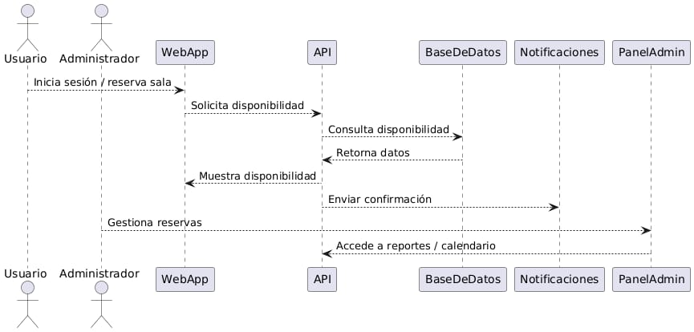
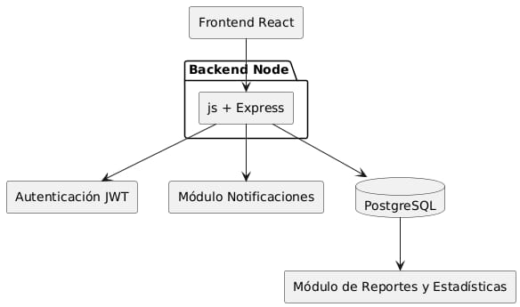
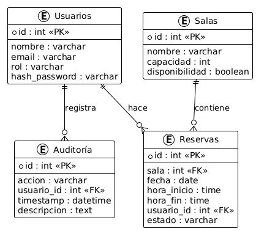
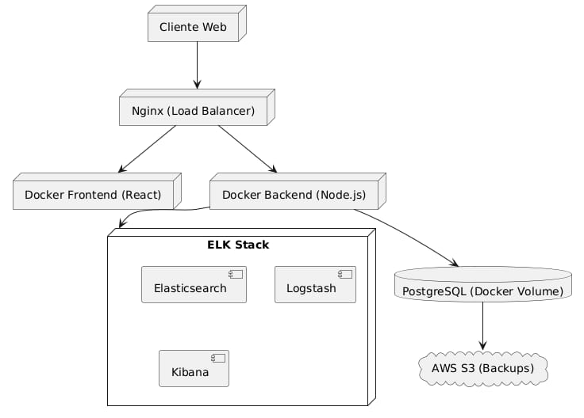

<!-- ============================================= -->
<!--                Portada del Informe             -->
<!-- ============================================= -->

  

---

# **Informe 2**

---

**Asignatura:** ARQUITECTURA DE SISTEMAS Sec. 2  
**Docente:** Eliana Jackeline Vivas Rafael  

---

## Integrantes
- Nevile Olguin  
- Mateo Moreira  
- Javiera Soto  
- Ian Schmidt  

---

**Fecha de entrega:** Jueves 24 de junio de 2025  

<!-- ============================================= -->

---

## Índice

1. Evaluación inicial (PoC)  
2. Propuesta de arquitectura to-be  
   - Arquitectura de Procesos  
   - Arquitectura de Aplicaciones y Datos  
   - Arquitectura de Infraestructura  
3. Justificación de decisiones arquitectónicas  
4. Mejoras a nivel de código y patrones  
5. Discusión y conclusiones  
6. Bibliografía  
7. Anexos

---

## 1. Evaluación inicial: pruebas de estrés del sistema actual (As-Is)

Primero realizamos una evaluación del sistema actual utilizado por Nysa Arts para gestionar sus reservas, el cual está compuesto por una planilla de Excel alojada en OneDrive y la comunicación informal mediante canales como WhatsApp, Instagram y llamadas telefónicas. Esta arquitectura As-Is, al ser completamente manual, nos llevó a simular un escenario de estrés para observar cómo responde ante una demanda elevada.

En particular, modelamos un caso en que se reciben simultáneamente 20 solicitudes de reserva durante un horario de alta demanda (por ejemplo, viernes entre 18:00 y 20:00 horas). Durante esta prueba, identificamos varios problemas críticos:

Colisiones al momento de escribir en la planilla, cuando dos administradores intentan editar al mismo tiempo.

Riesgo de sobrescritura de datos y pérdida de reservas ya ingresadas.

Tiempos de respuesta prolongados hacia el cliente (entre 12 y 24 horas en promedio).

Ausencia total de alertas automáticas o registro de auditoría.

A partir de estos resultados, concluimos que el sistema actual no está preparado para soportar múltiples usuarios concurrentes ni para garantizar una operación confiable durante momentos clave. La dependencia del trabajo manual genera cuellos de botella, errores y una experiencia deficiente tanto para el cliente como para el equipo administrativo.

## 1.2. Propuesta de arquitectura To-Be: diseño de la nueva solución

Frente a estas limitaciones, proponemos una arquitectura moderna, automatizada y escalable que permita a Nysa Arts operar de forma más eficiente y entregar una mejor experiencia tanto a clientes como al equipo administrativo.

### Frontend (Capa de Presentación)

Desarrollaremos una aplicación web responsiva en **React**, que los usuarios podrán usar desde cualquier dispositivo (móvil o escritorio). Esta interfaz permitirá visualizar en tiempo real la disponibilidad de salas, completar reservas, editarlas o cancelarlas, y recibir confirmaciones automáticas. Será intuitiva y accesible, pensada para usuarios no técnicos.

### Backend (Lógica de Aplicación)

La lógica de negocio estará implementada en **Node.js**, donde se procesarán las solicitudes, se validará la disponibilidad y se enviarán notificaciones automáticas. Este backend actuará como intermediario entre el frontend, la base de datos y otros servicios, asegurando consistencia en las operaciones y mayor velocidad de respuesta.

### Servicios (API RESTful)

Toda la comunicación entre el frontend, el backend y la base de datos se realizará a través de una **API REST**, lo que permite mantener una arquitectura desacoplada, más fácil de mantener y escalar. Esto también permitirá integrar futuros servicios como pasarelas de pago, Google Calendar o redes sociales.

### Base de Datos (Capa de Datos)

Utilizaremos una base de datos **PostgreSQL**, donde se almacenará toda la información estructurada de usuarios, salas, horarios, reservas e inventario de equipos. Esta base permitirá hacer consultas rápidas, generar reportes históricos y alimentar futuros módulos de análisis predictivo.

### Infraestructura en la nube

La solución será desplegada en servicios en la nube como **Heroku o Firebase**, lo que garantiza alta disponibilidad, escalabilidad automática, respaldo continuo y facilidad de mantenimiento. Además, incorporaremos un **balanceador de carga** que distribuirá el tráfico entre múltiples instancias del backend, mejorando la estabilidad en horarios de alta demanda.

### Seguridad

La seguridad será un pilar clave. Usaremos **autenticación basada en JWT (JSON Web Tokens)**, cifrado con **HTTPS/TLS 1.2 o superior**, control de roles y validaciones en cada punto crítico del sistema. Esto nos permitirá proteger tanto la información de los usuarios como las operaciones realizadas.

### Monitoreo y Logs

Integraremos un sistema de monitoreo y visualización de logs basado en **ELK Stack** (Elasticsearch, Logstash y Kibana), que permitirá hacer seguimiento en tiempo real del funcionamiento del sistema, detectar errores y emitir alertas automáticas ante fallas o comportamientos anómalos.

### Respaldo y recuperación ante fallos

Se implementarán **backups automáticos** y un sistema de recuperación rápida en caso de fallos. Por ejemplo, ante la caída de un contenedor, la plataforma podrá restablecer el servicio en menos de 2 minutos, lo que asegura una disponibilidad ≥ 99%, incluso en escenarios críticos.

### Módulo predictivo (futuro)

En una siguiente etapa, consideramos integrar un módulo de análisis predictivo basado en modelos como **SARIMA**, que nos permitirá anticipar la ocupación de las salas y mejorar la planificación operativa y comercial.

# 2 Propuesta de Arquitectura To-Be para Nysa Arts Book

Este documento presenta la propuesta de arquitectura **To-Be** para modernizar el sistema de reservas de salas en Nysa Arts Book, incluyendo automatización, escalabilidad y seguridad mediante el uso de tecnologías modernas.

---

## 2.1 🧭 Arquitectura de Procesos (To-Be)

 **Objetivo:** Automatizar el proceso de reserva de salas mediante una plataforma web accesible desde cualquier dispositivo.

### 📌 Diagrama de Procesos

### Explicación

- El usuario accede a la plataforma desde cualquier navegador.
- La Web App se comunica con una **API RESTful** que gestiona las reservas.
- Las peticiones van a una **base de datos relacional** que valida disponibilidad y almacena la información.
- Se generan **notificaciones automáticas** para usuario y administrador.
- El administrador visualiza el calendario, acepta/rechaza reservas y puede generar reportes.

---

## 2.2  Arquitectura de Aplicaciones y Datos

###  Diagrama de Aplicaciones

### 🗃️ Diagrama de Datos

#### Tablas principales:

- `Usuarios (id, nombre, email, rol, hash_password)`
- `Reservas (id, sala, fecha, hora_inicio, hora_fin, usuario_id, estado)`
- `Salas (id, nombre, capacidad, disponibilidad)`
- `Auditoría (id, accion, usuario_id, timestamp, descripcion)`

### 📝 Explicación

- El **frontend en React** consume la API para enviar y recibir datos.
- El backend en **Node.js** gestiona la lógica de negocio, validaciones y seguridad.
- Se utiliza **PostgreSQL** para almacenar los datos con integridad referencial.
- Se incluye un **módulo de estadísticas** para reportes de uso del sistema.

---

## 2.3 🖥️ Arquitectura de Infraestructura

### 🛰️ Diagrama de Infraestructura

### 📝 Explicación

- Toda la aplicación está **containerizada con Docker**.
- **Nginx** funciona como balanceador de carga y proxy inverso.
- Se implementan **microservicios separados** para frontend, backend y base de datos.
- **Backups automáticos** se almacenan en la nube (ej. AWS S3).
- Se centralizan logs y monitoreo con **ELK Stack** (Elasticsearch, Logstash, Kibana).

---

## 🔁 Comparación As-Is vs. To-Be

| Elemento               | As-Is                        | To-Be                                         |
|------------------------|------------------------------|-----------------------------------------------|
| Proceso de Reserva     | Manual por WhatsApp/Excel    | Web App con disponibilidad en tiempo real     |
| Sincronización         | Propensa a errores            | API centralizada y consistente                |
| Historial              | No disponible                 | Auditoría digital completa                    |
| Seguridad              | Nula                          | JWT + TLS                                     |
| Disponibilidad         | Limitada a horario humano     | Acceso 24/7                                   |

---

     
## 3. Justificación de decisiones arquitectónicas

La propuesta de arquitectura futura para la plataforma de reservas de **Nysa Arts Book** ha sido diseñada para responder directamente a las principales brechas del sistema actual (_as-is_), que dependía de procesos manuales poco eficientes y con escasa capacidad de control.  
Las decisiones arquitectónicas tomadas se fundamentan en los principios de arquitectura empresarial y están orientadas a mejorar atributos clave de calidad como disponibilidad, trazabilidad, seguridad, escalabilidad, resiliencia y mantenibilidad.

---

## a. Automatización del proceso de reservas

**Brecha detectada:**  
El proceso de reserva de salas se gestionaba manualmente mediante mensajes de WhatsApp y hojas de cálculo en Excel. Este enfoque informal generaba errores frecuentes, duplicidad de información, sobrecarga administrativa y tiempos de respuesta lentos para los usuarios.

**Decisión arquitectónica:**  
Se implementó una plataforma web con una interfaz amigable y una API RESTful centralizada. Esta API gestiona todas las operaciones relacionadas con reservas, desde la consulta de disponibilidad hasta la confirmación y notificación.

**Mejora:**  
La automatización elimina tareas repetitivas, reduce errores humanos y mejora la experiencia del usuario al permitir autogestión de reservas en tiempo real, con acceso 24/7 desde cualquier dispositivo con conexión a Internet.

---

## b. Consistencia y control de datos

**Brecha detectada:**  
En el sistema anterior, la información de reservas no estaba estructurada ni normalizada, lo que dificultaba la trazabilidad, la generación de reportes y el análisis histórico. Además, no existía registro de modificaciones ni auditoría.

**Decisión arquitectónica:**  
Se definió una base de datos relacional (PostgreSQL) con integridad referencial, relaciones bien definidas y un módulo de auditoría que permite registrar toda acción relevante del usuario en la plataforma.

**Mejora:**  
Esto asegura la consistencia de los datos, permite generar informes detallados, detectar errores, auditar comportamientos y fundamentar decisiones estratégicas basadas en evidencia histórica.

---

## c. Seguridad y control de acceso

**Brecha detectada:**  
No existían mecanismos de autenticación, lo que significaba que cualquier persona podía realizar acciones sin verificación de identidad ni protección de la información.

**Decisión arquitectónica:**  
Se integró un sistema de autenticación mediante JSON Web Tokens (JWT) para identificar a usuarios y asignar roles (usuario, administrador). Además, todo el tráfico se cifra mediante TLS (HTTPS).

**Mejora:**  
Se garantiza la confidencialidad, integridad y autenticidad de la información intercambiada. Esto permite aplicar restricciones de acceso según perfiles y proteger los datos personales y operacionales frente a terceros no autorizados.

---

## d. Escalabilidad y mantenimiento

**Brecha detectada:**  
El sistema monolítico y manual era difícil de escalar o mantener. Cualquier cambio requería intervención directa en archivos compartidos o canales de mensajería, generando cuellos de botella y errores.

**Decisión arquitectónica:**  
Se adoptó una arquitectura de microservicios, separando los componentes de frontend (React), backend (Node.js/Express) y base de datos, todos desplegados en contenedores Docker. Esto facilita la escalabilidad horizontal y la actualización de módulos sin afectar a todo el sistema.

**Mejora:**  
La modularidad permite desarrollar, probar y escalar componentes de forma independiente, mejorando la mantenibilidad y reduciendo el tiempo de despliegue de nuevas funcionalidades.

---

## e. Gestión y monitoreo

**Brecha detectada:**  
En el sistema anterior no se registraban métricas, logs ni eventos. Cualquier error o caída pasaba desapercibido hasta que algún usuario lo notificaba.

**Decisión arquitectónica:**  
Se incorporó un sistema de monitoreo mediante el stack ELK (Elasticsearch, Logstash, Kibana), que recolecta logs, los almacena centralizadamente y permite visualizar el estado del sistema en tiempo real.

**Mejora:**  
Esta solución proporciona observabilidad, permitiendo diagnosticar problemas, detectar patrones anómalos, y optimizar el rendimiento del sistema de forma proactiva.

---

## f. Resiliencia y continuidad operativa

**Brecha detectada:**  
No existía ninguna política de respaldos ni mecanismos para recuperar información ante fallas o pérdidas de datos.

**Decisión arquitectónica:**  
Se habilitó un sistema de backups automáticos diarios de la base de datos, almacenados en un bucket privado en AWS S3. Además, se contempla una política de recuperación ante desastres.

**Mejora:**  
Se asegura la resiliencia del sistema y la continuidad del servicio incluso frente a caídas críticas, evitando pérdida de datos e interrupciones prolongadas.

---

## 4. Mejoras a nivel de código y patrones  

## 5. Discusión y conclusiones  

---

## 6. Bibliografía

- Informe de Avance Capstone (Grupo 6), Capstone Project, Nysa Arts, 2024.  
- Nysa Arts Demo. [https://nyssaa.netlify.app/](https://nyssaa.netlify.app/)

---

## 7. Anexos

- Diagramas de procesos  
- Diagramas de infraestructura  
- Resultados de pruebas de estrés  

